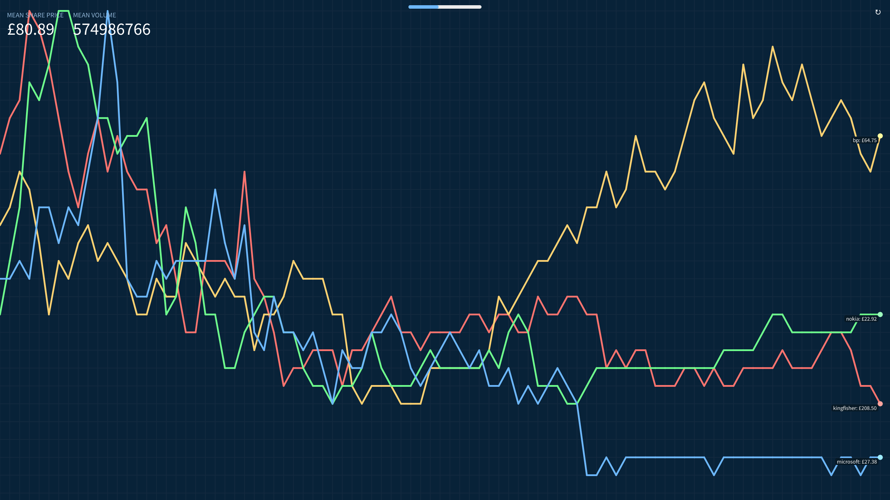

# Stonks2Midi Main Project
Welcome to Stonks2Midi's main project! We hope you enjoy the music generated from those valuable stonks.

## What is Stonks2Midi?
**Good question!** Basically Stonks2Midi is a project aimed at converting historical stock market data into nicely-sounding (most of the time) tunes with cool rhythmic patterns ─ the higher the share price, the higher the musical note! We also provide a graph for those who are nerds/entrepreneurs.

You can choose which companies you want to listen to and assemble stock market-driven musical bands! Different companies have different grooves, so you can mix and match the companies to make groovy tunes!

## Demo
Go to [stonks2midi.github.io/stonks2midi](https://stonks2midi.github.io/stonks2midi)!

## Suggested compositions
A deep, emotional, but equally exciting piece: `kingfisher` `bp` `nokia` `microsoft`

A upbeat, retro and intense piece: `intel` `microsoft` `bac` `berkshire`

## Inspirational quotes

> I have no idea how the stock market works.
>
> _- James_

> It sounds like actual music!
>
> _- Josh_

> We can have McDonalds playing the guitar.
>
> _- Also Josh_

> Wetherspoons is immortal.
>
> _- William_

> We have lots of S T O N K S.
>
> _- Also William_

> Stonks are great!
>
>_- Oliver_
